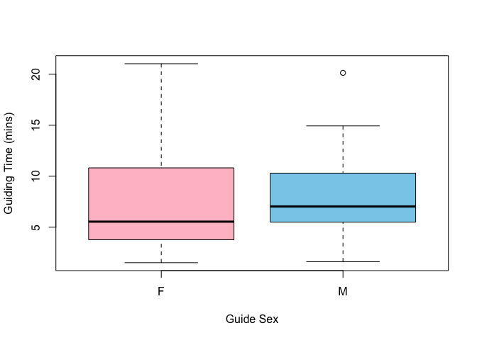
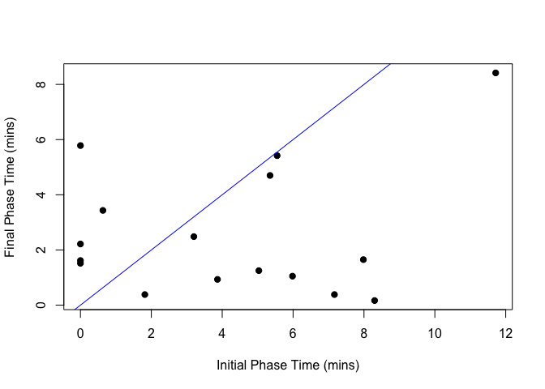

# README

## Introduction

This is my 2nd hand-in for Jasper’s Honours module on data and
reproducability.

The data I have used is from David Lloyd-Jones’s github repository that
includes all of the data and code he used for his 2025 PhD thesis
entitled “Cooperation, ecology and behaviour in the honeyguide-human
mutualism”, and for his article “To bees or not to bees: greater
honeyguides sometimes guide humans to animals other than bees, but
likely not as punishment”. His repository is available here:
<https://github.com/dlloyd-jones/guiding_to_non_bees>.

## Data Wrangling

The data I worked with describes specific honeyguide-human guiding
experiences. Each row is a new incident and include variables describing
honeyguide age, sex, the location of the tree the human was guided to,
as well as length of the phases of the interaction. A full description
of each variable can be found in the file Variable Names.

The data set was relatively neat. I changed the classes of most of the
variables, and then added in some useful extra columns relating to the
total times of guiding interactions.

    Rows: 24
    Columns: 27
    $ date                   <chr> "2018-05-18", "2018-06-06", "2018-06-07", "2018…
    $ group                  <chr> "A", "B", "B", "B", "B", "B", "B", "B", "A", "B…
    $ guide_age              <int> 4, 4, 4, 4, 1, 4, 3, 4, 4, 4, 4, 4, 4, 4, 4, 4,…
    $ guide_sex              <chr> "F", "F", "F", "M", "unk", "M", "M", "M", "M", …
    $ bee                    <chr> "NB", "apis", "apis", "apis", "apis", "apis", "…
    $ harvested              <chr> NA, "N", "N", "N", "N", "Y", "Y", "Y", NA, "N",…
    $ treeID                 <chr> "PUFFADDER", "DBEES14", "DBEES15", "DBEES16", "…
    $ follow_GPStrackID      <chr> "CNS22", "C3", "C5", "C6", "C7", "C10", "C13", …
    $ audio_trackID          <chr> NA, "C3_fp", NA, "C6_fp", "C7_fp", "C10_fp", "C…
    $ audio_start_indication <dbl> NA, 0.6673264, NA, 0.4587500, 0.4901273, 0.4651…
    $ audio_finish_woo       <dbl> 0.3933102, 0.6697106, NA, 0.4590162, 0.4916667,…
    $ indication_to_woo      <dbl> NA, 2.384259e-03, NA, 2.662037e-04, 1.539352e-0…
    $ beetree_lat            <dbl> -12.03495, -12.14279, -12.08957, -12.08278, -12…
    $ beetree_lon            <dbl> 37.99447, 38.05123, 38.07404, 38.05814, 38.0572…
    $ guiding_starttime      <dbl> -2209042480, -2209017581, -2209039652, -2209035…
    $ finalphasecalls_time   <dbl> NA, -2209017543, NA, -2209035564, -2209032853, …
    $ foundtree_time         <dbl> -2209041218, -2209017337, -2209039444, -2209035…
    $ dist_fp_start_to_bees  <int> NA, 11, NA, 30, 102, 54, 106, 240, NA, 45, 40, …
    $ followdist_crowfly     <int> 505, 53, 87, 289, 113, 88, 241, 262, 122, 400, …
    $ follow_trackdist       <int> 838, 73, 116, 327, 150, 106, 318, 242, 160, 588…
    $ GPSguiding_starttime   <dbl> -2209042480, -2209017581, -2209039652, -2209035…
    $ GPSguiding_endtime     <dbl> -2209041218, -2209017337, -2209039444, -2209035…
    $ avg_speed_kph          <dbl> 2.39, 1.10, 2.00, 2.56, 2.36, 1.95, 1.74, 2.72,…
    $ guiding_totaltime      <dbl> 21.033333, 4.066667, 3.466667, 7.550000, 2.2166…
    $ finalphase_totaltime   <dbl> NA, 3.4333333, NA, 0.3833333, 2.2166667, 1.6166…
    $ initialphase_totaltime <dbl> NA, 0.6333333, NA, 7.1666667, 0.0000000, 0.0000…
    $ bee_group              <chr> "Other", "Apis", "Apis", "Apis", "Apis", "Apis"…

Above is a glimpse of the dataset.

## Data Visualisations

I played around with a few plots to visualise the data. These were
mainly boxplots that compared distance travelled and time of interaction
versus guide age and sex, as well as the animal guided to. Below is one
such plot, comparing guiding interaction time across the sexes.

There is also a scatter plot relating the final phase time of the
guiding interaction with the initial phase time. After this (but not
shown here) comes a histogram of difference in time between these two
phases.

The last code chunk plots a map of the trees guided to as well as
whether there was a bee hive found (Apis) or another animal.

